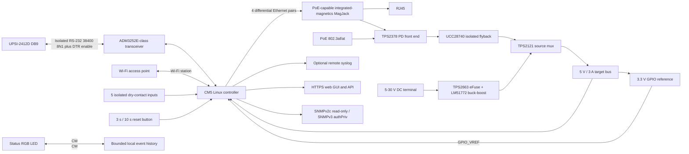

# Bicker-Control Full: System Architecture

Status: preliminary architecture for review. This document records the agreed requirements and the current hardware/software selections. Component choices marked as candidates still require datasheet, sourcing, and bench verification before the EasyEDA schematic is frozen.

## Product scope

Network-enabled controller for the Bicker UPSI-2412D. The three-input control behavior from Bicker-Control_small is retained and extended to five configurable dry-contact inputs. The device provides a web interface, SNMPv2c/v3, event history, and remote access to documented UPS measurements and settings. It does not provide a transparent serial-to-TCP bridge.

The controller is powered from downstream of the UPS output. It must therefore not assume it remains online while the UPS output is switched off. A timed UPS restart must be scheduled by the UPS itself before the controller loses power.

## Agreed requirements

- Ethernet and Wi-Fi station mode may operate concurrently. The device does not create a Wi-Fi access point.
- RJ45 Ethernet supports PoE; an auxiliary 5-30 V DC input is also provided. Both may be connected together, and either must be able to power the unit alone. A brief interruption during source change is acceptable.
- Five potential-free inputs are individually assignable by the admin to root-authorized actions. Multiple inputs may use the same action.
- A UPS output restart is permitted only when a fresh UPS status reports mains present. A shutdown may be permitted during battery operation according to root policy; restart is never attempted there.
- Web roles are root, admin, and user. Root defines admin capabilities and safety limits. Admin can only grant users a subset of their own permitted capabilities.
- SNMPv2c is read-only. SNMPv3 authPriv supports read/write, with SET access subject to the same action and role policy as the web API. Traps and informs are supported.
- Store a configurable event/measurement history in a bounded local ring buffer, with up to 1 GiB reserved. Optional external syslog forwarding is supported.
- Long-press reset: under 3 s does nothing; 3-10 s selects network reset; 10 s or longer selects full factory reset. The selected action executes on release.
- The operating environment can reach 70 C. Select parts with suitable ratings and provide a thermal path from the compute module to the external heatsink.

## Controller selection

**Selected for the first design: Raspberry Pi Compute Module 5 (CM5), 4 GB RAM, 16 GB eMMC, Wi-Fi.** The user confirmed that this configuration is close in price to the available CM4 SC0673. With price parity, the newer CM5 is the better starting point for a new carrier design and avoids anchoring the product to the narrower CM4 supply situation. Its performance is far beyond the workload requirement, but gives comfortable headroom for Linux networking, HTTPS, SNMPv3, and logging.

The CM5 uses the same dual 100-pin module form factor as CM4, but a CM4 carrier must not be assumed to work unchanged. In particular, CM5 peripheral and Ethernet implementation must follow the CM5IO/reference-carrier design and current device-tree/kernel support. Use Raspberry Pi OS Bookworm or later with kernel 6.12 or later as documented for CM5. Reserve up to 1 GiB of the 16 GB eMMC for the bounded history; 16 GB total is sufficient if the OS image, database, and update strategy are kept controlled.

The product must operate at 70 C ambient. The user plans a heatsink coupled through the plastic enclosure. Confirm the exact CM5 module's rated temperature and validate the complete assembled thermal path under worst-case CPU, Ethernet, Wi-Fi, and storage load. The Wi-Fi AP is nearby, but the antenna still needs clear placement and must not be covered by the heatsink. Prefer the CM5 variant with the appropriate external antenna connector if the module/antenna SKU permits it.

## Preliminary hardware selection

| Function | Preliminary selection | Status / design note |
|---|---|---|
| Compute | Raspberry Pi CM5, 4 GB RAM, 16 GB eMMC, Wi-Fi | Selected; confirm exact ordering code, wireless/antenna option, and temperature rating |
| Ethernet | CM5 Ethernet differential pairs directly to PoE-capable integrated-magnetics MagJack and RJ45 | Official CM5IO rev. 2 schematic exposes four Ethernet pairs and its BOM contains a MagJack but no separate carrier PHY. Reuse pair names/routing guidance; confirm PoE center taps before selecting the MagJack |
| PoE powered-device front end | TI TPS2378 PD interface plus UCC28740-controlled isolated flyback to 5.1 V | Candidate; TPS2378 performs detection/classification/hot-swap, UCC28740 is the separate flyback controller. Transformer, secondary rectifier, feedback, compensation, thermal, and EMC still require design. TPS2378 rated -40 to +85 C |
| Auxiliary DC input | 5-30 V screw terminal, TI TPS2663 eFuse/protection, TI LM51772 4-switch buck-boost to 5.1 V | Candidate chain; TPS2663 is 4.5-60 V / 6 A, LM51772 is 3.5-55 V / -40 to +125 C and requires external MOSFETs/inductor. Validate 5 V boost-mode current and surge clamp |
| Power-source selection | TI TPS2121 two-input mux after both 5.1 V converter outputs | Candidate; 2.7-22 V inputs, up to 4.5 A, reverse-current blocking and seamless switchover. Configure auxiliary DC as preferred; verify 3 A conduction loss at 70 C |
| GPIO reference | CM5IO-reference 3.3 V buck from `SYS_5V` to CM5 `GPIO_VREF` contact 78 | Required at 3.3 V mode; AP3441SHE-7B is used on CM5IO and is a candidate to reuse after current/thermal check |
| UPS serial interface | ADI ADM3252E isolated RS-232 transceiver, UART at 38400 8N1 | Strong candidate; 2 Tx + 2 Rx channels cover UART plus separate DTR/enable output; 2.5 kV isolation, up to 460 kbit/s, -40 to +85 C. 44-ball BGA assembly and DB9 pin assignment need review |
| Five dry-contact inputs | Five separately filtered, protected optocoupler channels; isolated field-side loop supply; two-terminal input per channel | Topology selected; choose optocoupler, resistor values, ESD/surge parts, and input threshold after defining cable length and contact current |
| Reset / status | Sealed momentary button, RGB status LED, GPIO input with hardware pull and ESD protection | Selected; reset timing is implemented in a service and commits only on release |
| Time | NTP plus optional battery-backed RTC | RTC recommended for valid timestamps during network outages; select after power and board-space review |
| Storage | CM5 16 GB eMMC; SQLite event store with bounded retention | Selected; reserve up to 1 GiB for history and limit OS/journald separately |

### PoE power decision

The original PoE requirement was 802.3af. The chosen target is 802.3at / PoE+ with 802.3af detection compatibility. Use a provisional `SYS_5V` budget of 5 V at 3 A (15 W), matching the CM5IO 5 V / 3 A supply case with its peripheral-current restriction. This is a design envelope, not a measured CM5 load claim. The 3.3 V GPIO rail is derived after source selection, so either power input provides both rails.

- 802.3at Type 2 offers about 25 W at the PD. At a provisional 85% conversion efficiency, about 21 W reaches the 5 V bus, enough for the 15 W envelope with margin.
- 802.3af offers about 13 W at the PD. At 85% efficiency, only about 11 W is available at the 5 V bus, approximately 2.2 A at 5 V. It may run the actual controller load, but 3 A full-load operation cannot be guaranteed on af without measuring the CM5 under worst-case CPU, eMMC, Ethernet, and Wi-Fi activity.
- At 5 V DC input, a 15 W bus load and 85% efficiency require about 17.6 W input, or 3.5 A. Specify a 5 V source rated for at least 4 A to guarantee the full envelope; ordinary 5 V / 3 A USB supplies may need a reduced-load profile. At 30 V input, the same power is about 0.6 A before margin.
- Efficiency, thermal derating, TPS2121 drop, 3.3 V regulator load, and CM5 peak current are provisional. Measure at 70 C ambient before finalizing the guaranteed power profile.

PoE++ / IEEE 802.3bt is **not selected for this revision**. Its Type 3/4 four-pair PD circuitry adds cost, wiring, and thermal design effort without a current load above the 15 W bus target. Revisit it if measured worst-case load exceeds the PoE+ budget or the product later adds high-power peripherals. A future Type 3/4 option can use a TPS2372-family PD controller, but requires a redesigned PoE extraction/converter stage and a MagJack verified for four-pair PoE current.

## Functional block diagram

## Input actions and UPS arbitration

The documented UPSI command set in the reference project supports these initial action families:

1. Retain the existing inhibit/enable control behavior.
2. Select a root-defined Maximum Backup Time profile through parameter 0x02. A baseline profile applies when no profile input is active.
3. Switch the UPS output off.
4. Switch the UPS output off and request timed restart with command 0x21, only when mains is confirmed.
5. Record an event and optionally emit an SNMP trap/inform without changing the UPS state.

Root defines available actions, allowed time ranges, UPS parameters that may be changed, and what a restart input does while on battery. Safe default: reject and log a restart request if the UPS status is stale, communication is down, or mains is absent. Shutdown during battery operation is a separately enabled action, never an implicit fallback.

Each input has polarity, debounce, activation/release delay, and one assigned action/profile. Action commands are edge-triggered and rate-limited so a contact held closed cannot repeatedly restart the UPS. If multiple backup-time profiles are active, the default arbitration is the shortest requested backup time (most restrictive); Root may change this policy. All serial transactions pass through one queue/owner to prevent web, SNMP, and input actions from interleaving frames.

The exact `UpsOutput` set payload, supported restart delay, persistence, and behavior across controller power loss must be verified on the target UPS firmware before enabling restart actions for customers.

## Reset button behavior

Use a debounced state machine with monotonic timing. No action occurs before release:

| Hold duration | Indication | Action on release |
|---|---|---|
| Less than 3 s | No selection indication | None |
| 3 s to less than 10 s | LED on | Network reset: return Ethernet to DHCP, clear static network settings and Wi-Fi credentials; preserve users, UPS configuration, and event history |
| 10 s or longer | LED turns off, then distinctive slow pulse | Full factory reset: clear application configuration, credentials, network settings, and local history; reboot into wired first-run setup |

The full reset must not install a known default password. The wired first-run flow creates a new root credential. A reset event should be recorded where possible; a full reset intentionally clears the prior local ring history.

## Software architecture

- **OS:** 64-bit Raspberry Pi OS Lite on eMMC, Bookworm or later with kernel 6.12 or later, minimal packages, unattended service startup, SSH disabled by default, firewall enabled, and a hardware/software watchdog strategy.
- **UPS service:** one process owns the RS-232 port, parses length-framed Bicker packets, caches the latest measurements/status, serializes requests, and verifies writes by read-back where supported.
- **Policy/API service:** Python 3 with FastAPI for the HTTPS UI/API, input assignments, role checks, settings validation, action audit, and shared command policy. Store configuration transactionally in SQLite.
- **SNMP:** Net-SNMP master agent with SNMPv2c read-only and SNMPv3 authPriv. Expose documented standard UPS-MIB values where mappings are valid, plus a project enterprise MIB for Bicker-specific values and controls. Use an AgentX subagent or equivalent narrow adapter so SNMP SET passes through the same policy/API layer; do not expose arbitrary protocol frames.
- **Users and delegation:** Root defines Admin capability ceilings and safety limits. Admin grants a subset of allowed read/configure/action rights to User. SNMP identities are mapped to the same authorization policy. Store password verifiers with Argon2id and audit every security-sensitive change.
- **History:** SQLite event/measurement tables with configurable sampling and a 1 GiB retention ceiling; purge oldest data when the limit is reached. Buffer/coalesce writes and monitor eMMC health. Optional syslog forwarding uses a configurable remote endpoint; TLS transport is preferred where supported by the server.
- **Networking:** Ethernet DHCP/static IPv4, Wi-Fi station configuration, mDNS discovery, optional IPv6, and NTP. Network reset recovery uses DHCP plus a documented IPv4 link-local fallback; no AP mode.
- **Time:** use NTP when reachable and a battery-backed RTC if accurate offline timestamps are required.

## EasyEDA design sequence

1. Freeze power-source input limits and choose PoE+ policy after an estimated and measured load budget.
2. Build the CM5 compute-module, boot/eMMC programming, Wi-Fi antenna, and direct Ethernet-pair-to-MagJack/RJ45 section from CM5IO reference routing.
3. Add PoE PD, auxiliary DC protection/conversion, power mux, and 5 V rail with test points and current measurement.
4. Add isolated UPS RS-232 and DB9 nets; verify all UPS connector pin directions before assembly.
5. Add five isolated contact inputs, reset input, LED, RTC, programming/debug access, and board test points.
6. Run ERC, review high-speed layout constraints, isolation clearances, PoE safety, thermal path, and manufacturing checks before PCB release.

## Open verification items

- Obtain the exact CM5 variant part number and confirm 4 GB RAM, 16 GB eMMC, wireless/antenna option, and temperature rating together.
- Copy the CM5IO Ethernet pair mapping and routing guidance; verify the selected MagJack's PoE center taps and ratings before finalizing the PD interface.
- Confirm CM5 carrier power rails, boot/eMMC programming, wireless antenna routing, and required Raspberry Pi OS/kernel versions from current CM5 design documentation.
- Complete rail-by-rail peak/average power budget for CM5 boot, CPU/storage activity, Ethernet, Wi-Fi transmit, and transceiver; prove operation on both PoE classes and on 5 V DC input.
- Define the DC source transient envelope, reverse-polarity duration/current, wiring length, and maximum expected input current before selecting protection ratings.
- Verify UPSI RS-232 pin directions, DTR/DSR behavior, parameter-write persistence, output shutdown/restart command semantics, and restart delay on the target unit/firmware.
- Define input cable length/installation and required immunity level before finalizing optocoupler current, terminal protection, and isolation spacing.
- Decide exact syslog protocol/certificates, IPv6 scope, and offline RTC requirement during software design.
- Complete EMC, surge, ESD, PoE interoperability, thermal, power-source switchover, recovery-button, and long-duration log-write tests on prototypes.

## Reference sources

- Raspberry Pi Compute Module documentation: https://www.raspberrypi.com/documentation/computers/compute-module.html
- CM5 datasheet: https://pip.raspberrypi.com/documents/RP-008180-DS
- CM5IO design files: https://rpltd.co/cm5io-design-files
- CM5IO revision 2 KiCad archive (official): https://pip-assets.raspberrypi.com/categories/1098-design-files/documents/RP-008099-DD-1-CM5%20IO%20Board,%20revision%202,%20KiCAD%20files..zip
- TI TPS2378 product page: https://www.ti.com/product/TPS2378
- TI UCC28740 product page: https://www.ti.com/product/UCC28740
- TI TPS2663 product page: https://www.ti.com/product/TPS2663
- TI LM51772 product page: https://www.ti.com/product/LM51772
- TI TPS2121 product page: https://www.ti.com/product/TPS2121
- Analog Devices ADM3252E product page: https://www.analog.com/en/products/adm3252e.html
- UPSI-2412D manuals are included in the repository as PDF files; the software/protocol assumptions are also summarized in the Bicker-Control_small reference README.